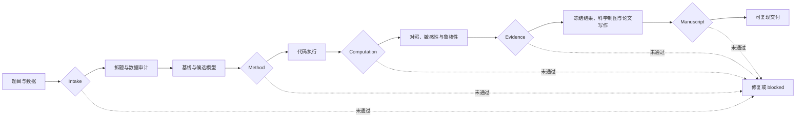

# Math Modeling Solver

面向数学建模竞赛与应用项目的端到端 Codex Skill。它可以完成题目拆解、数据审计、模型选择、Python/MATLAB 编程、结果验证、科学制图和论文写作，并通过证据门与自动审计保证代码、数字、图表和结论能够相互追溯。

## 能做什么

| 能力 | 主要任务 | 典型产出 |
| --- | --- | --- |
| 题目分析 | 识别目标、约束、子问题和依赖关系 | 问题契约、子问题图、数据需求 |
| 数据审计 | 检查来源、缺失值、异常值、单位和数据泄漏 | 数据审计表、拆分策略、风险清单 |
| 模型选择 | 建立可解释基线并比较候选模型 | 模型假设、公式、选择理由、备用方案 |
| 编程求解 | 使用 Python 或 MATLAB 实现并运行模型 | 可执行代码、运行命令、结果文件 |
| 结果验证 | 对照基线，进行敏感性、鲁棒性和不确定性分析 | 指标表、扰动实验、误差与边界 |
| 科学制图 | 根据真实结果规划图表信息和多面板结构 | SVG/PDF/PNG、图表合同、数据映射 |
| 论文写作 | 以论点和证据组织摘要、方法、结果和结论 | 论文大纲、正文、术语与符号账本 |
| 交付审计 | 检查模型、代码、数字、图表和论文的一致性 | JSON 与 Markdown 审计报告 |

## 完整工作流



工作流采用五道证据门：

1. `Intake`：题目契约、子问题和数据审计完整。
2. `Method`：基线、候选模型、可行性和选择理由明确。
3. `Computation`：代码实际运行，输入输出和运行命令可复现。
4. `Evidence`：完成公平对照、误差分析、敏感性或鲁棒性验证。
5. `Manuscript`：论文结论、数字、表格、图片、术语和引用一致。

当数据、假设、方法或参数改变时，受影响的下游结果必须重新运行和验证。

## 支持的模型类型

- 综合评价：TOPSIS、AHP、熵权法、DEA、灰色关联和组合评价。
- 预测与分类：ARIMA、GM(1,1)、回归、随机森林、XGBoost、SVM 和神经网络。
- 优化决策：线性规划、整数规划、动态规划、遗传算法、粒子群、模拟退火和多目标优化。
- 网络与路径：最短路、最大流、中心性、调度、选址和路径规划。
- 机制与仿真：微分方程、状态转移、排队、库存、可靠性、Monte Carlo 和 Agent-based 模型。
- 统计分析：聚类、PCA、假设检验、时间序列、生存分析和因果设计。

仓库提供 15 个 Python 与 7 个 MATLAB 算法模板，包括 TOPSIS、灰色预测、ARIMA、线性/整数规划、遗传算法、粒子群、组合评价和分类模型。模板用于快速建立基线，正式结论仍必须经过数据适配、执行验证和鲁棒性检查。

## 三种运行模式

| 模式 | 使用条件 | 数据规则 |
| --- | --- | --- |
| `formal` | 正式竞赛、论文或项目交付 | 只使用真实、可追溯数据，不允许静默生成替代数据 |
| `demo` | 教学、结构演示或方法试验 | 可以使用明确标注的示例/合成数据，不得冒充正式结果 |
| `blocked` | 缺少关键数据、定义或授权 | 记录阻塞原因和所需输入，不伪造结果继续写结论 |

## 安装

克隆仓库，并使用 Skill 名作为安装目录：

```powershell
git clone https://github.com/YANG985-CMD/math-modeling-playbook.git `
  "$HOME\.codex\skills\math-modeling-solver"
```

重新启动 Codex 会话后调用：

```text
$math-modeling-solver
```

## 快速开始

在 Skill 根目录初始化一个包含 3 个子问题的正式项目：

```powershell
python scripts/init_modeling_project.py D:\modeling\problem-a --mode formal --questions 3
```

项目结构：

```text
problem-a/
├─ input/                         # 原始题目与数据
├─ planning/
│  ├─ problem-contract.json       # 目标、约束、子问题和依赖
│  ├─ method-decision.json        # 基线、候选模型与验证方案
│  ├─ figure-contract.json        # 图表信息、面板证据与导出要求
│  └─ data-audit.csv              # 数据来源与质量检查
├─ src/                           # 可执行代码
├─ results/
│  ├─ tables/
│  ├─ figures/
│  └─ frozen-results.json         # 论文采用的权威结果
├─ paper/
│  ├─ manuscript-contract.json    # 核心论点、受众、证据与边界
│  ├─ terminology-ledger.csv      # 术语、符号和单位标准
│  └─ main.md
└─ audit/
   ├─ reproducibility-manifest.json
   ├─ claim-evidence-ledger.csv
   └─ latest-audit.md
```

交付前运行：

```powershell
python scripts/audit_modeling_project.py D:\modeling\problem-a
```

审计器会检查五道证据门，并指出缺少的输入、审批、结果文件、验证证据或论文映射。只有全部必要门通过时才返回成功状态。

## 使用示例

```text
使用 $math-modeling-solver 拆解这道数学建模题，画出子问题依赖，
建立最简单基线，再比较三个候选模型。
```

```text
使用 $math-modeling-solver 按 formal 模式完成这个预测问题。
检查时间泄漏，采用滚动验证，并把论文结论映射到真实结果表。
```

```text
使用 $math-modeling-solver 检查我的 TOPSIS 排名为什么不稳定，
设计权重扰动实验，并判断是否需要 TOPSIS—灰色关联组合模型。
```

```text
使用 $math-modeling-solver 根据运行结果规划论文图片。
先定义每张图的一句话结论、面板职责、数据来源和误差表达，再输出 SVG/PDF。
```

```text
使用 $math-modeling-solver 写竞赛论文。
先锁定核心论点、术语和权威结果，再组织摘要、问题分析、模型、验证与结论。
```

```text
使用 $math-modeling-solver 制定 6 小时冲刺方案。
保留可以验证的基线，删除来不及完成公平比较的复杂模型。
```

## 质量原则

1. 不虚构数据、运行结果、指标、引用或图片结论。
2. 先运行可解释基线，再根据可观察失败决定是否增加复杂度。
3. 时间数据、分组数据和空间数据使用与结构匹配的验证方案。
4. 每个重要结论必须对应结果文件、表格、图片、公式或可靠来源。
5. 定量图表必须由可追溯数据和代码生成，AI 图片不能作为经验数据证据。
6. 记录假设、单位、随机种子、软件版本、命令和输入来源。
7. 明确报告不确定性、失败情形、适用范围和未解决风险。

## Skill 结构

```text
math-modeling-solver/
├─ SKILL.md
├─ agents/openai.yaml
├─ scripts/
│  ├─ init_modeling_project.py
│  └─ audit_modeling_project.py
├─ references/
│  ├─ problem-triage.md
│  ├─ task-family-router.md
│  ├─ model-selection.md
│  ├─ evidence-gated-workflow.md
│  ├─ data-and-reproducibility.md
│  ├─ validation-playbook.md
│  ├─ figure-contract-and-qa.md
│  ├─ argument-first-paper-writing.md
│  └─ ...
├─ assets/
│  ├─ templates/
│  └─ code/python/、code/matlab/
└─ tests/
```

## 环境

- Python 3，用于项目初始化、审计与 Python 算法模板。
- MATLAB，用于运行 MATLAB 算法模板。
- 具体模型可能需要 NumPy、pandas、SciPy、scikit-learn、statsmodels、Matplotlib 或其他科学计算库。
