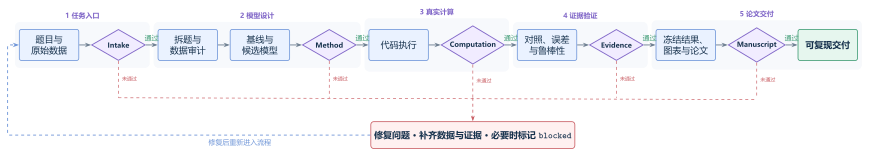
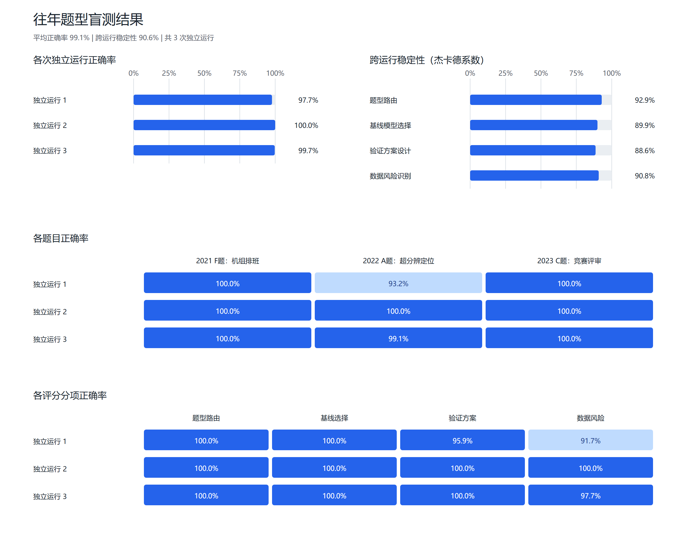

<div align="center">

# Math Modeling Solver

**从一道数学建模题，到可复现模型、论文级图表与完整竞赛论文。**

[](./SKILL.md)


面向数学建模竞赛的端到端 Agent Skill，建议搭配matlab的官方mcp使用，直接向codex发送指令：帮我配置一下这个mcp，链接：https://github.com/matlab/matlab-mcp-server


</div>


## 它是什么

Math Modeling Solver 不是只会罗列算法的提示词集合。它是一套以证据为中心的数学建模工作流，把题目拆解、数据检查、模型选择、代码执行、鲁棒性验证、科学绘图和论文写作连接为一个可审计过程。

它要求每个关键结论都能追溯到真实数据、执行代码、结果表、图、公式或可靠来源，并通过五道证据门阻止“代码没有运行、图表没有来源、论文数字互相矛盾”等常见问题进入最终交付。

## 版本更新日志

### v2.1.0 - 结构真实性、候选晋级与 CUMCM LaTeX（2026-07-19）

- 新增语义契约：计算前固定坐标轴、符号、单位、指标公式、约束含义，以及“观测/推断/表观/因果”边界。
- 新增有效支持与可辨识性门：报告独立重复数、连续支持长度、局部覆盖、缺失区域和低支持结论边界。
- 新增结构真实性门：低残差、回路闭合、轮廓系数或交叉验证改善不能替代几何、拓扑、守恒和物理状态检查。
- 新增预测—决策分离与不确定性传播：分别验证上游估计、效用/成本、可行性和最终决策稳定性。
- 新增多目标覆盖审计：单个非支配点只能称为权衡候选，不能冒充 Pareto 前沿。
- 新增 `audit_candidate_evidence.py`、候选验证模板和强制结构化晋级报告；拒绝仅含 `{"status":"passed"}` 的空证据。
- 将可复现性、敏感性、鲁棒性和泛化拆成独立证据门，并强制声明实例特化调度与验证独立性。
- 新增实验家族累计候选预算、父实验和自适应搜索偏差记录，以及路径首次分叉审计。
- 新增 MATLAB–Python 标量/数组/JSON/中文路径真实预检，防止正式搜索后才发现桥接失真。
- 新增冻结结果自动生成论文表格和 CUMCM LaTeX/PDF 交付前检查。
- 将数学建模正式交付主线收敛为 CUMCM LaTeX，移除非 LaTeX 文档审计脚本、文档 QA 模板和对应交付配置。
- 新增 `explore`、`candidate`、`delivery` 三级工作流路由，只启用当前阶段适用的证据门。
- 新增旧报告分级审计（`legacy_schema`、`incomplete_evidence`、`invalid_result`）和自动实验运行包装器。
- 新增失败现象—方法机制路由表，帮助从基线失败定位下一步建模方向。
- 新增 CUMCM 2026 LaTeX 独立模板、可复现编译和格式预检，并要求逐页检查最终 PDF。
- 修复已达阈值候选被后续较差运行错误降级的问题，并增加回归测试。

### v2.0.0 - 诊断优先与 MATLAB 原生增强（2026-07-18）

- 新增得分差距诊断门：优化前量化理论上界、基线、参考值、分项目差距和加权敏感度。
- 新增代理模型—精确仿真一致性门：Beam Search、MPC 等扩大搜索前至少逐步核对 50 个状态转移。
- 新增硬约束动作掩码规范：违法动作不再依靠事后惩罚或修复，而是在搜索前排除。
- 新增实验预算、晋级阈值与停止规则，以及 `exploratory → candidate → independently_validated → frozen → manuscript` 结果生命周期。
- 新增 MATLAB MCP、MATLAB 优化器与 MATLAB 原生论文绘图路线，不再强制定量图跨语言转到 Python。
- 新增 `paper-bundle`、`cumcm-latex`、`code-only` 与自定义交付配置。
- 新增 4 个可执行诊断/实验工具和配套回归测试。

## 核心能力

| 模块 | 能做什么 | 主要产出 |
| --- | --- | --- |
| 题目拆解 | 识别目标、约束、子问题、依赖关系和隐藏假设 | 问题契约、子问题图、数据需求 |
| 数据审计 | 对 CSV、Excel、MAT 等文件执行类型、缺失、异常、单位、泄漏和拆分检查 | JSON/CSV/HTML 审计报告、风险清单、处理方案 |
| 模型选择 | 建立可解释基线，比较候选模型并控制复杂度 | 方法决策、数学公式、验证计划 |
| 优化诊断 | 计算得分上界、参考差距、分项价值，核对精确状态转移并屏蔽非法动作 | 差距报告、一致性报告、实验预算与晋级记录 |
| 编程求解 | 生成并执行 Python 或 MATLAB 模型 | 源代码、运行命令、结果文件 |
| 结果验证 | 完成基线对照、语义核对、有效支持、结构真实性、敏感性、鲁棒性和不确定性检验 | 指标表、结构检查、扰动实验、适用边界 |
| 科学绘图 | 从论文结论和数据结构选择图表，生成定量图与模型架构图 | SVG、PDF、300 dpi PNG、灰度图 |
| 论文写作 | 以论点和证据组织摘要、模型、结果、讨论与结论 | 论文大纲、正文、术语账本 |
| CUMCM LaTeX | 生成独立模板、可复现编译并执行 2026 格式预检 | TeX、PDF、构建清单、审查 JSON |
| 交付审计 | 检查代码、数字、图表、论文和复现信息的一致性 | JSON/Markdown 审计报告 |

## 证据门工作流




五道门分别检查：

1. `Intake`：目标、约束、子问题和数据来源是否明确。
2. `Method`：基线、候选方法、可行性试验和验证设计是否完整。
3. `Computation`：代码是否真实运行，输入、环境、命令和输出能否复现。
4. `Evidence`：结论是否经过公平对照、误差分析和稳健性验证。
5. `Manuscript`：论文中的数字、图表、术语、单位和引用是否一致。

上游数据、假设、方法或参数改变时，受影响的下游结果必须重新运行，不能继续沿用旧结论。

对带评分函数或离散事件仿真的优化题，Method 与 Computation 之间还增加三项专门门槛：先分析得分差距，再把硬约束编码为动作掩码，最后核对代理模型与精确仿真的逐步一致性。高分但不可行或状态转移不一致的结果不能晋级为论文结果。

候选结果晋级前还必须通过结构化验证：主指标、可行性、语义定义、有效支持、任务特定结构检查和鲁棒性缺一不可；多目标与多阶段流水线按需增加覆盖和不确定性传播检查。低残差但几何错误、聚类清晰但语义无法识别、表观损失但不能证明真实泄漏等结果会被限制在正确的主张边界内。

## 可执行数据审计

`scripts/audit_dataset.py` 把数据审计从人工模板升级为可复现程序，支持 CSV、TSV、分隔文本/DAT、Excel 多工作表和二维 MAT 变量。它会保留输入文件 SHA-256，并检查：

- 字段类型、缺失率、重复行、常量列；
- IQR 异常值、极端偏态、非有限值和混合单位；
- 类别不平衡、目标副本及近乎完美的目标相关；
- 时间乱序、训练—验证时间交叉和分组穿越；
- 高维小样本风险与匹配数据结构的验证划分建议；
- MAT 复数矩阵；高维数组和结构体会要求显式轴定义。

审计结果同时输出 JSON、字段级 CSV 和可浏览 HTML。自动标记是待核验证据，不会擅自删除异常值，也不能在缺少“特征何时可用”的业务定义时宣称不存在未来信息泄漏。

## 往年题型盲测

`scripts/blind_modeling_benchmark.py` 用“公开题包 → 独立方案冻结 → 隔离评分”测试题型路由、基线选择、验证设计和数据风险识别。Agent 在作答阶段只能看到题目、附件、公开标签目录和 Skill；所有运行冻结后才加载评分表，因此测量的是泛化能力而不是题解记忆。

仓库包含一个三题型试验集，覆盖机组优化排班、移动场景超分辨定位和大规模竞赛评审。题目文件不进入仓库，公开清单只保存外部链接与 SHA-256。评分同时报告：

- 与隔离评分表的一致性；
- 多次独立运行的任务族、基线、验证规则和数据风险 Jaccard 稳定性；
- 每道子问题的路由、基线、验证和风险分项结果。

下面不是功能示意图，而是 3 道往年题、11 个子问题、3 次相互隔离的独立运行所得的真实评分结果：

[](assets/images/blind-benchmark-dashboard.svg)

<p align="center"><sub>点击图片可查看可编辑 SVG。结果来自方案冻结后的隔离评分；这是当前三题型回归基线，不是泛化能力的最终证明。</sub></p>


稳定不等于正确，单个公开试验集上的高分也不等于已经泛化。详细隔离规则见 [`blind-benchmarking.md`](references/blind-benchmarking.md)。

## 论文级绘图系统

绘图流程先回答“这张图要证明什么”，再决定使用哪种图。系统会检查变量类型、样本量、分组、单位、基线、不确定性和验证方式，并要求每张图只有一个主结论。

### 定量图

- 方法比较与不确定性；
- 预测曲线、置信区间和验证分界；
- 优化收敛与约束违例；
- 分组原始点与分布摘要；
- Pareto 前沿与可行解；
- 单因素/双因素敏感性热图；
- 中文字体、色盲友好配色和灰度冗余编码。

### 模型架构图

使用 JSON 描述节点和关系，由代码生成流水线、分层系统、反馈闭环或基线—方案对照图。输出保留为可编辑 SVG/PDF，不依赖手工拖拽。


### 图表交付与审计

每张正式图应包含：

- 一句话视觉结论和读者问题；
- 面板职责、指标、单位、基线与不确定性；
- 源数据、生成脚本和确定性命令；
- SVG/PDF 矢量主文件、300 dpi PNG 和灰度预览；
- 自动 QA JSON 与最终尺寸人工预览。

图包审计器会检查缺失坐标轴、过小字号、文字越界、DPI、最终尺寸、矢量文字、源数据、统计说明和复现命令。AI 生成图片不能充当定量结果证据。

## 支持的模型族

- **综合评价**：TOPSIS、AHP、熵权法、DEA、灰色关联、组合评价。
- **预测分类**：GM(1,1)、ARIMA、回归、随机森林、XGBoost、SVM、神经网络。
- **优化决策**：线性规划、整数规划、动态规划、遗传算法、粒子群、模拟退火、多目标优化。
- **网络路径**：最短路、最大流、中心性、选址、调度、路径规划。
- **机理仿真**：微分方程、状态转移、排队、库存、可靠性、Monte Carlo、Agent-based 模型。
- **统计分析**：聚类、PCA、假设检验、时间序列、生存分析、因果设计。

仓库包含 Python 与 MATLAB 基线模板。模板用于快速建立可执行起点，不能替代针对真实数据的适配、执行和验证。论文图可使用 Python/Matplotlib 或 MATLAB 原生生成；两条路线都必须保留源数据、生成代码、统计定义、矢量/位图导出和最终尺寸视觉检查。跨语言 CSV/MAT 交接是可选路线，不是强制要求。

## 安装

### Codex

Windows PowerShell：

```powershell
git clone https://github.com/YANG985-CMD/Math-Modeling-Solver.git `
  "$HOME\.codex\skills\math-modeling-solver"
```

macOS / Linux：

```bash
git clone https://github.com/YANG985-CMD/Math-Modeling-Solver.git \
  ~/.codex/skills/math-modeling-solver
```

重新启动 Codex 会话后，可直接调用：

```text
$math-modeling-solver
```

## 快速开始

### 1. 直接解决建模题

```text
使用 $math-modeling-solver 解决这道数学建模题。
先拆分子问题、审计数据并建立简单基线，再比较候选模型。
代码必须真实运行，最后给出稳健性分析、论文级图表和结论边界。
```

### 2. 初始化可审计项目

```powershell
python scripts/init_modeling_project.py D:\modeling\problem-a `
  --mode formal --workflow-profile explore --questions 3 --delivery-profile cumcm-latex
```

生成的工作区包含问题契约、数据审计、方法决策、结果冻结、图表契约、论文契约、主张—证据账本和复现清单。工作流配置只决定当前阶段启用哪些门，不改变 `formal/demo/blocked` 数据真实性标签。

### 3. 解析当前阶段的必需门

```powershell
python scripts/resolve_required_gates.py `
  --profile explore --task-family scheduling `
  --feature path_dependent --feature mixed_backend `
  --delivery-profile cumcm-latex --out audit/gate-requirements.json
```

探索阶段只保留基线、语义、可运行性和硬约束；候选阶段再启用精确仿真、实验预算、鲁棒性等门；LaTeX/PDF 格式审查延迟到交付阶段。

结果准备晋级时，可用 `--project-state audit/project-state.json --profile candidate --update-project-state` 更新阶段，不需要手改 JSON。

候选运行可让程序自动登记运行日志、耗时、候选数量、结果哈希和环境：

```powershell
python scripts/run_experiment.py planning/experiments.json `
  --id E01 --result-json results/E01/run.json -- `
  matlab -batch "run('src/run_e01.m')"
```

命令通过环境变量 `MMS_RESULT_JSON` 获取结果路径；结果 JSON 至少包含 `value`、`feasible`、`fidelity` 和 `candidates_evaluated`。

### 4. 优化前分析得分差距

```powershell
python scripts/analyze_score_gap.py score-contract.json `
  --out-dir results/diagnostics/score-gap
```

输入为加权归一化评分契约；输出 JSON 与 CSV，分别给出理论上界、基线、参考差距、分项优先级与单位边际价值。若真实评分函数不是加权归一化和式，应按真实公式自行推导，不能套用该工具。

### 5. 核对代理模型与精确仿真

```powershell
python scripts/check_transition_fidelity.py `
  surrogate-trajectory.json exact-trajectory.json `
  --min-steps 50 --out results/diagnostics/transition-fidelity.json
```

两条轨迹必须使用相同初态、动作序列和事件时间，并逐步给出 `state`、`action` 与 `feasible_actions`。状态、时间、动作集合或精确可行性任一不一致都会失败。

### 6. 审计候选结果的结构证据

```powershell
python scripts/audit_candidate_evidence.py `
  D:\modeling\problem-a\audit\candidate-validation.json `
  --root D:\modeling\problem-a
```

报告从 `assets/templates/candidate-validation-template.json` 创建。主指标通过后，仍需分别核对可复现性、敏感性、鲁棒性、泛化、验证独立性和实例特化边界；多目标和多阶段模型还要检查覆盖与不确定性传播。

审计输出会区分 `legacy_schema`（旧格式）、`incomplete_evidence`（证据未补齐）和 `invalid_result`（结果或主张本身不成立）。旧报告缺少新版字段不等于数值结果自动失效。

### 7. 预检 MATLAB–Python 桥接与路径依赖轨迹

```powershell
python scripts/preflight_matlab_python_bridge.py `
  --out audit/matlab-python-preflight.json

python scripts/audit_decision_trace.py audit/decision-trace.json `
  --root D:\modeling\problem-a `
  --out audit/decision-trace-audit.json
```

前者必须真实启动 MATLAB，并检查标量、数组、JSON 中文和中文路径往返；后者核对原候选集、硬约束过滤集、实际动作、首次分叉及最终得分变化。

### 8. 同步冻结结果

```powershell
python scripts/render_frozen_results.py results/frozen-results.json `
  --root D:\modeling\problem-a `
  --out paper/generated/frozen-results.md
```

冻结结果表只从 `frozen-results.json` 生成；正式论文使用 CUMCM LaTeX 模板编译为 PDF，并按第 12 节执行格式预检。

### 9. 审计真实数据

```powershell
uv run --with pandas --with scipy --with openpyxl --with xlrd `
  python scripts/audit_dataset.py D:\modeling\problem-a\input\data.xlsx `
  --target label --time timestamp --group subject_id --split split `
  --out-dir D:\modeling\problem-a\audit\dataset
```

如果没有某个角色列，删除对应参数即可。Excel 默认检查全部工作表；MAT 默认检查所有可转为二维表的变量。

### 10. 生成绘图示例

```powershell
python assets/code/python/demo_modeling_figure.py `
  --out build/figure-demo
```

### 11. 生成模型架构图

```powershell
python scripts/build_modeling_diagram.py --demo `
  --out build/diagram/modeling-loop
```

也可以从 [`modeling-diagram-spec-template.json`](assets/templates/modeling-diagram-spec-template.json) 创建自己的 JSON 结构图。

### 12. 编译并审查 CUMCM 2026 LaTeX 论文

从独立编写的 `ctexart` 模板开始，不依赖来源或许可不明的社区 `.cls`：

```powershell
Copy-Item assets/latex/cumcm-2026/paper.tex D:\modeling\problem-a\paper.tex

python scripts/build_cumcm_latex.py `
  D:\modeling\problem-a\paper.tex `
  --output-dir D:\modeling\problem-a\build\cumcm

python scripts/audit_cumcm_latex.py `
  D:\modeling\problem-a\paper.tex `
  --pdf D:\modeling\problem-a\build\cumcm\paper.pdf `
  --support-archive D:\modeling\problem-a\support.zip `
  --body-pages 24 `
  --json-out D:\modeling\problem-a\build\cumcm\audit.json `
  --strict
```

审查器覆盖 A4、页边距、摘要顺序、目录、匿名字段、交叉引用、占位符和文件大小等可自动检查项。正式提交前仍须核对当年官方通知，并逐页检查最终 PDF 的公式、图表、分页和乱码。

### 13. 审计图表和项目

```powershell
python scripts/audit_figure_bundle.py `
  build/figure-demo/figure-contract.json `
  --root build/figure-demo --strict

python scripts/audit_modeling_project.py D:\modeling\problem-a
```

## 三种运行模式

| 模式 | 使用场景 | 数据规则 |
| --- | --- | --- |
| `formal` | 正式竞赛、课程论文或项目交付 | 只使用真实、可追溯数据 |
| `demo` | 教学、结构演示和环境测试 | 可使用明确标注的合成数据 |
| `blocked` | 缺少关键数据、定义或授权 | 记录阻塞，不伪造结果继续写作 |

## 四种交付配置

| 配置 | 最终交付 | 工作区仍需保留 |
| --- | --- | --- |
| `paper-bundle` | 论文、代码、结果、完整图包与审计记录 | 全部证据链 |
| `cumcm-latex` | 国赛 TeX、最终 PDF、构建清单与格式审查结果 | 源码、图表、支撑材料、编译日志与证据链 |
| `code-only` | 可执行代码、测试、命令与结果摘要 | 输入契约与验证诊断 |
| `custom` | 用户明确约定的文件 | 支撑最终主张所需的底层证据 |

交付配置只决定“交什么”，不降低真实性、可行性、仿真一致性或复现要求。

## 项目交付结构

```text
problem-a/
├─ input/                         # 题目与原始数据
├─ planning/
│  ├─ problem-contract.json       # 目标、约束与子问题
│  ├─ method-decision.json        # 基线、候选模型与验证方案
│  ├─ experiments.json            # 假设、预算、停止规则与结果晋级
│  ├─ figure-contract.json        # 图表结论、数据与导出要求
│  └─ data-audit.csv              # 数据来源与质量检查
├─ src/                           # 可执行代码
├─ results/
│  ├─ tables/
│  ├─ figures/
│  └─ frozen-results.json         # 论文采用的权威数字
├─ paper/
│  ├─ manuscript-contract.json    # 论文论点、证据与边界
│  ├─ terminology-ledger.csv      # 术语、符号和单位
│  └─ main.md
└─ audit/
   ├─ candidate-validation.json
   ├─ reproducibility-manifest.json
   ├─ claim-evidence-ledger.csv
   └─ latest-audit.md
```

## 典型用法

```text
使用 $math-modeling-solver 检查这个时间序列方案是否存在数据泄漏，
设计滚动验证，并把论文中的预测结论映射到真实结果表。
```

```text
使用 $math-modeling-solver 检查 TOPSIS 排名为什么不稳定，
设计权重扰动实验，并判断是否需要组合评价模型。
```

```text
使用 $math-modeling-solver 根据已有结果重构论文图表。
每张图先确定一个主结论，再生成 SVG、PDF、PNG、灰度图和 QA 报告。
```

```text
使用 $math-modeling-solver 写数学建模竞赛论文。
先冻结权威结果和术语，再组织摘要、模型、结果、验证、讨论与结论。
```

## Skill 结构

```text
math-modeling-solver/
├─ SKILL.md
├─ agents/openai.yaml
├─ scripts/
│  ├─ init_modeling_project.py
│  ├─ audit_dataset.py
│  ├─ analyze_score_gap.py
│  ├─ check_transition_fidelity.py
│  ├─ register_experiment.py
│  ├─ run_experiment.py
│  ├─ resolve_required_gates.py
│  ├─ audit_candidate_evidence.py
│  ├─ promote_validated_candidate.py
│  ├─ audit_decision_trace.py
│  ├─ preflight_matlab_python_bridge.py
│  ├─ render_frozen_results.py
│  ├─ blind_modeling_benchmark.py
│  ├─ audit_modeling_project.py
│  ├─ audit_figure_bundle.py
│  └─ build_modeling_diagram.py
├─ references/                    # 按任务渐进加载的方法参考
├─ benchmarks/                    # 只含外部链接、哈希、响应模板和隔离评分契约
├─ assets/
│  ├─ templates/                  # 问题、方法、图表和论文契约
│  ├─ code/python/                # 算法与科学绘图工具
│  ├─ code/matlab/                # MATLAB 算法基线
│  └─ images/                     # README 展示图
└─ tests/
```

## 验证开发环境

使用 `uv` 运行完整测试：

```powershell
uv run --with matplotlib --with numpy --with pillow --with pandas `
  --with scipy --with openpyxl --with xlrd `
  python -m unittest discover -s tests -v
```

验证 Skill 结构：

```powershell
uv run --with pyyaml python `
  "$HOME\.codex\skills\.system\skill-creator\scripts\quick_validate.py" .
```

## 质量边界

- 不虚构数据、运行结果、评价指标、引用或图片结论。
- 先运行简单基线，再根据可观察失败决定是否增加复杂度。
- 时间、分组和空间数据必须使用结构匹配的验证方案。
- 低残差、闭环一致或较高聚类指标不能替代输出状态的几何、拓扑、守恒和有效支持检查。
- 预测、估计或检测结果必须与下游决策质量分开验证，并传播上游不确定性。
- 单个非支配解不得描述为 Pareto 前沿。
- 代表性轨迹不能替代总体统计证据。
- 优化收敛图必须同时检查约束可行性。
- 论文中的每个重要主张都必须链接到可核验的证据。
- 明确报告不确定性、失败情形、适用范围和未解决风险。

## 许可证

本项目采用 [PolyForm Noncommercial License 1.0.0](LICENSE)：

- 个人学习、研究、实验及其他非商业用途可免费使用、修改和分发；
- 禁止将本项目或其衍生作品用于任何商业用途；
- 商业使用、商业集成或商业分发需要事先联系仓库所有者并取得单独授权。

本许可证包含商业用途限制，因此属于源码可用许可证，并非 OSI 认可的开源许可证。

---

如果你需要的是一个能从题目一直工作到可复现论文交付的数学建模 Agent，直接从 `$math-modeling-solver` 开始。

<!-- skill-provenance:v1;owner=YANG985-CMD;id=YANG985-CMD-MMS-2026-v14;path=README.md;sha256=97cd6554b65f02c089e69fdeed4ccc129f612b3b7fb50a9d5227999782980164;pub=0ofp8dKKJWMQK0LUC4dZDC8cynCRQlggy7cVeq7NfBo=;sig=zkTzlu-9ER4KMGgp8RyTESh0LVmHogYntN0oRDScDzGfTO8-3s3ebo8YoRHniYGxbn4h7wOx-ubKzNsx3CTrBQ== -->
