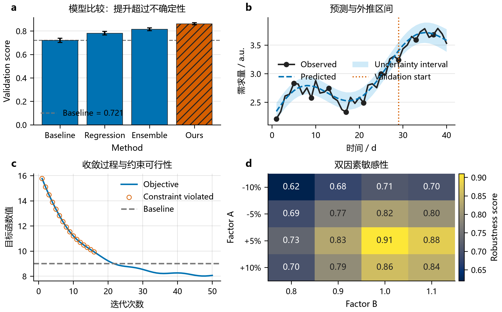
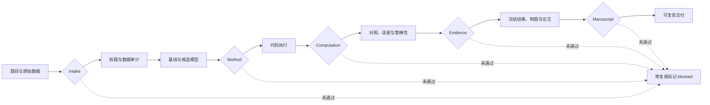
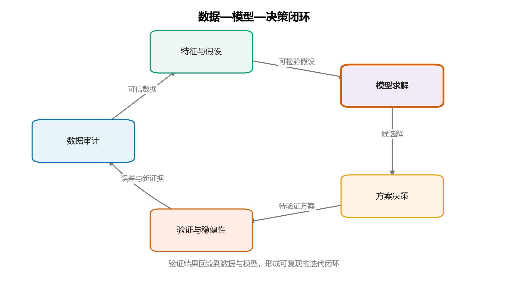

<div align="center">

# Math Modeling Solver

**从一道数学建模题，到可复现模型、论文级图表与完整竞赛论文。**

[](./SKILL.md)


面向数学建模竞赛、课程论文与应用项目的端到端 Agent Skill。

</div>



## 它是什么

Math Modeling Solver 不是只会罗列算法的提示词集合。它是一套以证据为中心的数学建模工作流，把题目拆解、数据检查、模型选择、代码执行、鲁棒性验证、科学绘图和论文写作连接为一个可审计过程。

它要求每个关键结论都能追溯到真实数据、执行代码、结果表、图、公式或可靠来源，并通过五道证据门阻止“代码没有运行、图表没有来源、论文数字互相矛盾”等常见问题进入最终交付。

## 核心能力

| 模块 | 能做什么 | 主要产出 |
| --- | --- | --- |
| 题目拆解 | 识别目标、约束、子问题、依赖关系和隐藏假设 | 问题契约、子问题图、数据需求 |
| 数据审计 | 检查来源、单位、缺失、异常、泄漏和拆分方式 | 数据审计表、风险清单、处理方案 |
| 模型选择 | 建立可解释基线，比较候选模型并控制复杂度 | 方法决策、数学公式、验证计划 |
| 编程求解 | 生成并执行 Python 或 MATLAB 模型 | 源代码、运行命令、结果文件 |
| 结果验证 | 完成基线对照、误差分析、敏感性、鲁棒性和不确定性检验 | 指标表、扰动实验、适用边界 |
| 科学绘图 | 从论文结论和数据结构选择图表，生成定量图与模型架构图 | SVG、PDF、300 dpi PNG、灰度图 |
| 论文写作 | 以论点和证据组织摘要、模型、结果、讨论与结论 | 论文大纲、正文、术语账本 |
| 交付审计 | 检查代码、数字、图表、论文和复现信息的一致性 | JSON/Markdown 审计报告 |

## 证据门工作流



五道门分别检查：

1. `Intake`：目标、约束、子问题和数据来源是否明确。
2. `Method`：基线、候选方法、可行性试验和验证设计是否完整。
3. `Computation`：代码是否真实运行，输入、环境、命令和输出能否复现。
4. `Evidence`：结论是否经过公平对照、误差分析和稳健性验证。
5. `Manuscript`：论文中的数字、图表、术语、单位和引用是否一致。

上游数据、假设、方法或参数改变时，受影响的下游结果必须重新运行，不能继续沿用旧结论。

## 论文级绘图系统

绘图流程先回答“这张图要证明什么”，再决定使用哪种图。系统会检查变量类型、样本量、分组、单位、基线、不确定性和验证方式，并要求每张图只有一个主结论。

### 定量图

- 方法比较与不确定性；
- 预测曲线、置信区间和验证分界；
- 优化收敛与约束违例；
- 分组原始点与分布摘要；
- Pareto 前沿与可行解；
- 单因素/双因素敏感性热图；
- 中文字体、色盲友好配色和灰度冗余编码。

### 模型架构图

使用 JSON 描述节点和关系，由代码生成流水线、分层系统、反馈闭环或基线—方案对照图。输出保留为可编辑 SVG/PDF，不依赖手工拖拽。



### 图表交付与审计

每张正式图应包含：

- 一句话视觉结论和读者问题；
- 面板职责、指标、单位、基线与不确定性；
- 源数据、生成脚本和确定性命令；
- SVG/PDF 矢量主文件、300 dpi PNG 和灰度预览；
- 自动 QA JSON 与最终尺寸人工预览。

图包审计器会检查缺失坐标轴、过小字号、文字越界、DPI、最终尺寸、矢量文字、源数据、统计说明和复现命令。AI 生成图片不能充当定量结果证据。

## 支持的模型族

- **综合评价**：TOPSIS、AHP、熵权法、DEA、灰色关联、组合评价。
- **预测分类**：GM(1,1)、ARIMA、回归、随机森林、XGBoost、SVM、神经网络。
- **优化决策**：线性规划、整数规划、动态规划、遗传算法、粒子群、模拟退火、多目标优化。
- **网络路径**：最短路、最大流、中心性、选址、调度、路径规划。
- **机理仿真**：微分方程、状态转移、排队、库存、可靠性、Monte Carlo、Agent-based 模型。
- **统计分析**：聚类、PCA、假设检验、时间序列、生存分析、因果设计。

仓库包含 Python 与 MATLAB 基线模板。模板用于快速建立可执行起点，不能替代针对真实数据的适配、执行和验证。论文图统一使用 Python/Matplotlib；MATLAB 结果可保存为 CSV 或 MAT 后进入同一绘图流程。

## 安装

### Codex

Windows PowerShell：

```powershell
git clone https://github.com/YANG985-CMD/Math-Modeling-Solver.git `
  "$HOME\.codex\skills\math-modeling-solver"
```

macOS / Linux：

```bash
git clone https://github.com/YANG985-CMD/Math-Modeling-Solver.git \
  ~/.codex/skills/math-modeling-solver
```

重新启动 Codex 会话后，可直接调用：

```text
$math-modeling-solver
```

## 快速开始

### 1. 直接解决建模题

```text
使用 $math-modeling-solver 解决这道数学建模题。
先拆分子问题、审计数据并建立简单基线，再比较候选模型。
代码必须真实运行，最后给出稳健性分析、论文级图表和结论边界。
```

### 2. 初始化可审计项目

```powershell
python scripts/init_modeling_project.py D:\modeling\problem-a `
  --mode formal --questions 3
```

生成的工作区包含问题契约、数据审计、方法决策、结果冻结、图表契约、论文契约、主张—证据账本和复现清单。

### 3. 生成绘图示例

```powershell
python assets/code/python/demo_modeling_figure.py `
  --out build/figure-demo
```

### 4. 生成模型架构图

```powershell
python scripts/build_modeling_diagram.py --demo `
  --out build/diagram/modeling-loop
```

也可以从 [`modeling-diagram-spec-template.json`](assets/templates/modeling-diagram-spec-template.json) 创建自己的 JSON 结构图。

### 5. 审计图表和项目

```powershell
python scripts/audit_figure_bundle.py `
  build/figure-demo/figure-contract.json `
  --root build/figure-demo --strict

python scripts/audit_modeling_project.py D:\modeling\problem-a
```

## 三种运行模式

| 模式 | 使用场景 | 数据规则 |
| --- | --- | --- |
| `formal` | 正式竞赛、课程论文或项目交付 | 只使用真实、可追溯数据 |
| `demo` | 教学、结构演示和环境测试 | 可使用明确标注的合成数据 |
| `blocked` | 缺少关键数据、定义或授权 | 记录阻塞，不伪造结果继续写作 |

## 项目交付结构

```text
problem-a/
├─ input/                         # 题目与原始数据
├─ planning/
│  ├─ problem-contract.json       # 目标、约束与子问题
│  ├─ method-decision.json        # 基线、候选模型与验证方案
│  ├─ figure-contract.json        # 图表结论、数据与导出要求
│  └─ data-audit.csv              # 数据来源与质量检查
├─ src/                           # 可执行代码
├─ results/
│  ├─ tables/
│  ├─ figures/
│  └─ frozen-results.json         # 论文采用的权威数字
├─ paper/
│  ├─ manuscript-contract.json    # 论文论点、证据与边界
│  ├─ terminology-ledger.csv      # 术语、符号和单位
│  └─ main.md
└─ audit/
   ├─ reproducibility-manifest.json
   ├─ claim-evidence-ledger.csv
   └─ latest-audit.md
```

## 典型用法

```text
使用 $math-modeling-solver 检查这个时间序列方案是否存在数据泄漏，
设计滚动验证，并把论文中的预测结论映射到真实结果表。
```

```text
使用 $math-modeling-solver 检查 TOPSIS 排名为什么不稳定，
设计权重扰动实验，并判断是否需要组合评价模型。
```

```text
使用 $math-modeling-solver 根据已有结果重构论文图表。
每张图先确定一个主结论，再生成 SVG、PDF、PNG、灰度图和 QA 报告。
```

```text
使用 $math-modeling-solver 写数学建模竞赛论文。
先冻结权威结果和术语，再组织摘要、模型、结果、验证、讨论与结论。
```

## Skill 结构

```text
math-modeling-solver/
├─ SKILL.md
├─ agents/openai.yaml
├─ scripts/
│  ├─ init_modeling_project.py
│  ├─ audit_modeling_project.py
│  ├─ audit_figure_bundle.py
│  └─ build_modeling_diagram.py
├─ references/                    # 按任务渐进加载的方法参考
├─ assets/
│  ├─ templates/                  # 问题、方法、图表和论文契约
│  ├─ code/python/                # 算法与科学绘图工具
│  ├─ code/matlab/                # MATLAB 算法基线
│  └─ images/                     # README 展示图
└─ tests/
```

## 验证开发环境

使用 `uv` 运行完整测试：

```powershell
uv run --with matplotlib --with numpy --with pillow `
  python -m unittest discover -s tests -v
```

验证 Skill 结构：

```powershell
uv run --with pyyaml python `
  "$HOME\.codex\skills\.system\skill-creator\scripts\quick_validate.py" .
```

## 质量边界

- 不虚构数据、运行结果、评价指标、引用或图片结论。
- 先运行简单基线，再根据可观察失败决定是否增加复杂度。
- 时间、分组和空间数据必须使用结构匹配的验证方案。
- 代表性轨迹不能替代总体统计证据。
- 优化收敛图必须同时检查约束可行性。
- 论文中的每个重要主张都必须链接到可核验的证据。
- 明确报告不确定性、失败情形、适用范围和未解决风险。

---

如果你需要的是一个能从题目一直工作到可复现论文交付的数学建模 Agent，直接从 `$math-modeling-solver` 开始。

<!-- skill-provenance:v1;owner=YANG985-CMD;id=YANG985-CMD-MMS-2026-v1;path=README.md;sha256=789068a4fa1bd3faa6297253e1cc64002a4056a7929290c3ac5670784a45c705;pub=MZ8DANlU5cbnFaA4tGmWozbxVTaPI0z60znYRpFL9cY=;sig=5d7stYnx4ZqTQ2P3OA8vwm4PBHvbkFqnki8PkaB6mJi06KqYbFzoBmttkamtpiHQwddBxkp57OBUIBXOnrRFCQ== -->
